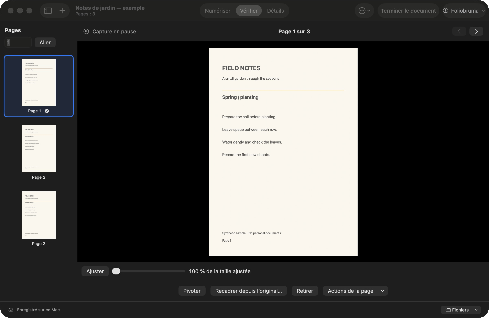
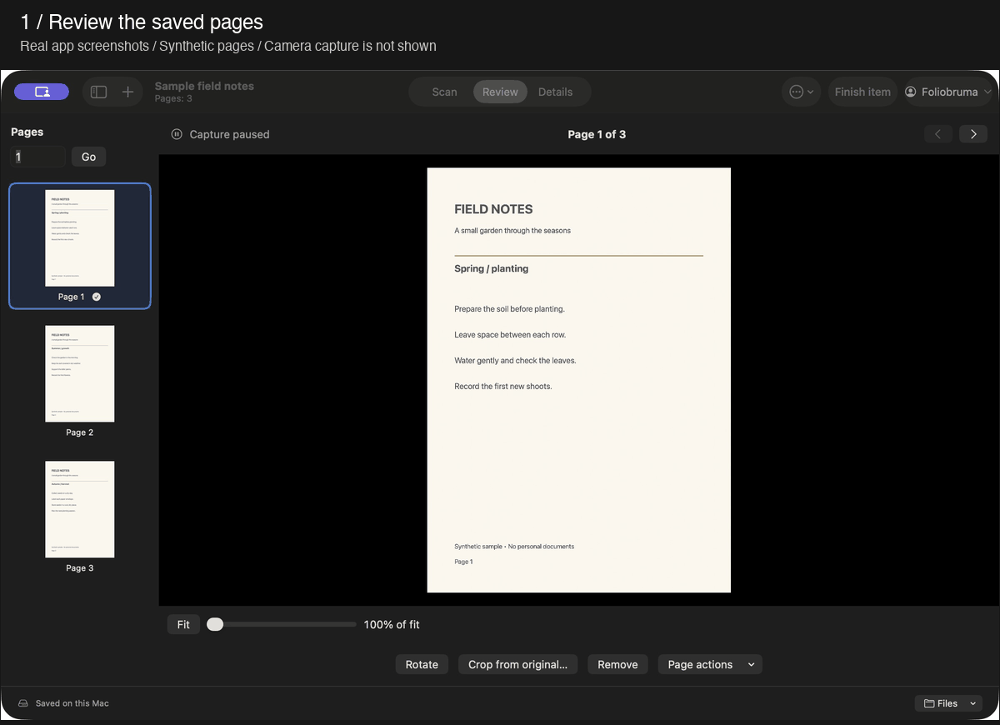
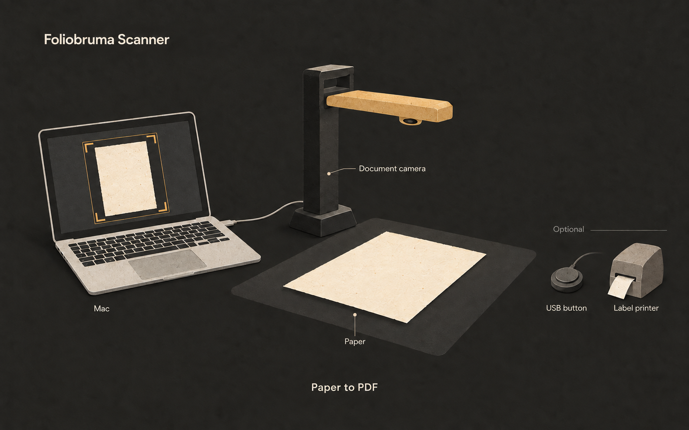

# Foliobruma Scanner

[English](README.md) · Français

**Transformez vos livres, lettres et documents papier en PDF sur votre Mac.**

Foliobruma est une application gratuite et open source pour les caméras de
documents. Capturez les pages, vérifiez-les, puis exportez un PDF. La numérisation
fonctionne hors ligne, sans compte. Vos scans restent sur votre Mac, sauf si
vous choisissez de les envoyer vers votre compte Foliobruma.

**[Télécharger pour Mac](https://github.com/AEnguerrand/foliobruma-scanner/releases/latest)**
· [Installation](#téléchargement-et-installation)
· [Caméras compatibles](#compatibilité-des-caméras)
· [Premier scan](#numériser-votre-premier-document)

Apple Silicon · macOS 14 ou version ultérieure · Gratuit, sous licence MIT · Français et anglais

*Interface réelle avec des pages fictives. Aucun document privé n’est montré.*

Voir la démonstration de vérification et de préparation de l’export PDF (environ 30 secondes)

Cette démonstration muette utilise des captures réelles de l’application en
anglais, affichées étape par étape, avec des pages fictives. Elle montre la
vérification et la préparation de l’export PDF, pas une capture en direct avec
une caméra. Pour numériser, suivez les étapes du [premier scan](#numériser-votre-premier-document).

> Version préliminaire. Les versions distribuées n’ont pas de signature Apple
> Developer ID ni de notarisation Apple. Consultez les étapes d’installation
> ci-dessous. Les mises à jour automatiques ne sont pas disponibles.

## Téléchargement et installation

Ouvrez la [dernière version](https://github.com/AEnguerrand/foliobruma-scanner/releases/latest)
et téléchargez le fichier **macOS-arm64.dmg**. Ouvrez-le, puis faites glisser
**Foliobruma Scanner** vers **Applications**. Éjectez l’image disque et ouvrez
l’application depuis Applications. Un Mac Apple Silicon avec macOS 14 ou une
version ultérieure est nécessaire. Xcode et les outils en ligne de commande
ne sont pas nécessaires pour installer une version distribuée. Une archive
ZIP est également disponible.

L’application possède une signature locale « ad hoc », mais pas de signature
Apple Developer ID ni de notarisation. Si macOS bloque l’ouverture et que vous
faites confiance au téléchargement, tentez d’ouvrir l’application, puis utilisez
**Réglages Système → Confidentialité et sécurité → Ouvrir quand même**.
Consultez les [instructions Apple](https://support.apple.com/fr-fr/102445).
Un Mac géré par une organisation peut interdire cette exception. Autorisez
l’accès à la caméra lorsque l’application le demande.

Pour mettre à jour l’application, quittez-la et remplacez-la dans Applications.
Les sessions restent dans leur dossier actuel. Consultez les
[instructions d’installation (en anglais)](RELEASE-INSTALL.txt) pour les sommes
de contrôle et les sauvegardes.

## Compatibilité des caméras

| Matériel | Résultat déjà consigné | Limites du résultat |
| --- | --- | --- |
| IRIScan Desk 6 Pro | Images vidéo reçues à 4160 × 3120, à 8 images/s. | Date, version de macOS et version de l’application non consignées. Pas de test complet de la version 0.4.0 dans ce relevé. |
| Commande USB IRIScan, identifiant `2e5a:2015` | Signal répétable reçu lors d’un test local. | Ce test ne valide pas chaque action attribuée au bouton. Date et versions non consignées. |
| Autres caméras USB et caméras intégrées au Mac | Aucun résultat matériel consigné dans ce tableau. | Compatibilité non vérifiée. |

Le relevé a été établi le 27 septembre 2026 à partir de la documentation
existante. Cette date n’est pas celle d’un nouveau test matériel. La caméra et
son bouton USB doivent être testés séparément. Consultez le
[guide de compatibilité (en anglais)](docs/cameras.md) pour les sources, les
étapes de test et le formulaire de compte rendu. Testez votre matériel avant
de commencer un grand lot.

## Numériser votre premier document

Utilisez une caméra USB pour documents, un fond contrasté et un éclairage
uniforme. L’image est une illustration du matériel, pas une capture de
l’application. Le bouton USB et l’imprimante d’étiquettes sont facultatifs.

1. Branchez la caméra en USB. Dans **Réglages de numérisation**, sélectionnez-la,
   puis cliquez sur **Connecter la caméra**.
2. Nommez le document avec **Actions du document → Renommer le document…**.
   Choisissez **Livre** ou **Page seule**.
3. Placez le papier sous la caméra et vérifiez le contour doré. Pour un livre,
   activez **Séparer en deux pages** et réglez la **Position de la reliure**.
4. Cliquez sur **Démarrer la capture automatique**, puis retirez vos mains.
   Attendez le signal vert d’enregistrement avant de tourner la page.
   Pour une capture manuelle, cliquez sur **Capturer la page** ou appuyez sur
   **Espace** en mode Numériser.
5. Ouvrez **Vérifier** pour corriger les pages. Utilisez
   **Actions du document → Exporter en PDF** (⌘E) pour enregistrer le résultat.

Pour une pile de feuilles, cliquez sur **Nouvel élément…** (+ ou ⌘N), choisissez
**Lot de feuilles**, puis **Commencer le lot**. Numérisez toutes les faces d’une
feuille, puis utilisez **Terminer la feuille** (⌘⇧Retour). Le panneau
**Documents** propose les filtres **Lot actuel** et **À vérifier**.
L’impression manuelle et l’impression automatique utilisent le même suivi
d’étiquette. Utilisez **Réimprimer…** uniquement si une autre copie est nécessaire.
Le contenu des boîtes de dialogue défile lorsque l’espace est limité ; les
boutons d’action restent en dessous. Les commandes de zoom s’adaptent aux
aperçus étroits.

Consultez [Numérisation et vérification (en anglais)](docs/scanning.md) pour
les signaux, les raccourcis et le choix de la langue. Vérifiez chaque scan :
la détection des mains, des doublons et des contours reste approximative.
Consultez aussi [Dépannage et limites (en anglais)](docs/troubleshooting.md).

## Fonctions

- **Capture automatique :** attend une page nette et immobile, avec des contrôles de mouvement, de mains et de doublons récents.
- **Recadrage automatique :** détecte les bords du papier et corrige la perspective.
- **Mode livre :** sépare une double page en deux, avec une position de reliure réglable.
- **Signaux de capture :** indique les pages enregistrées, les doublons, les obstacles et les photos rejetées par des sons et des signaux visuels.
- **Vérification des pages :** sélection, zoom, rotation, changement d’ordre, fusion, recadrage depuis l’original, remplacement et annulation de la dernière suppression.
- **Sessions enregistrées :** retrouve les documents par nom, nombre de pages et date de modification. Les images originales restent sur le Mac.
- **Export PDF :** enregistre les pages du document courant dans un PDF local.
- **Bouton USB :** attribue une action à un bouton physique. Fermez Réglages et sélectionnez la fenêtre du document pour l’utiliser.
- **Lots de feuilles :** conserve toutes les faces et tous les volets d’une feuille ; permet de terminer une feuille avec un bouton USB et de regrouper les feuilles ensuite.
- **Fiches et lots de lettres :** enregistre des détails sans scan, avec des références automatiques, un préfixe de nom facultatif et des détails communs au lot.
- **Étiquettes QR :** prévisualise, exporte et imprime une petite étiquette à partir d’un lien HTTPS existant. Le code QR est généré sur le Mac.

Cette version ne contient ni reconnaissance de texte (OCR), ni télémétrie.
L’envoi vers le compte Foliobruma est facultatif et désactivé par défaut.
Les PDF contiennent des images, sans couche de texte permettant une recherche.

## Réglages

Ouvrez **Réglages**, puis sélectionnez **Général**, **Bouton USB**, **Compte**
ou **Avancé**. La configuration USB indique si l’action est activée. Les
compteurs de signaux et les détails du périphérique sont dans **Diagnostic**.

## Documentation

Les guides détaillés suivants sont en anglais :

- [Compatibilité des caméras](docs/cameras.md) : résultats consignés et compte rendu de test.
- [Fiches et lots](docs/batches.md) : fiches sans scan, lettres et feuilles pliées.
- [Compte et envois](docs/foliobruma.md) : connexion facultative, envois et nouvelles tentatives.
- [Étiquettes QR et impression](docs/labels.md) : liens et configuration de la QL-600.
- [Bouton USB](docs/usb-button.md) : apprentissage et actions.
- [Fichiers et sauvegardes](docs/storage.md) : originaux, sessions et sauvegardes.
- [Toute la documentation](docs/README.md) : guides et notes de développement.

## Compiler et contribuer

Consultez [Compilation et développement (en anglais)](docs/development.md)
pour compiler l’application ou utiliser un serveur de test. Le guide
[Contribuer (en anglais)](CONTRIBUTING.md) décrit le code, les vérifications,
les versions et les signalements de problèmes.

L’application utilise les frameworks Apple, sans dépendance tierce à
l’exécution. Les opérations sur les documents, le stockage, les envois et les
règles de capture sont dans une bibliothèque Swift séparée. Consultez
[Code partagé et code propre à la plateforme (en anglais)](docs/shared-core.md).

## Licence

[MIT](LICENSE). Vous pouvez utiliser, modifier et distribuer l’application,
y compris à des fins commerciales, selon les conditions de cette licence.
