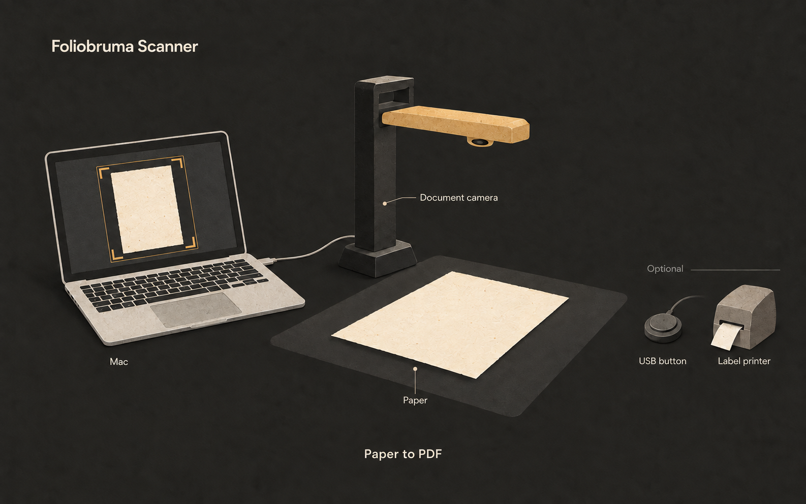

# Foliobruma Scanner

**Turn books, letters, and paper documents into PDFs on your Mac.**

Foliobruma is a free, open-source document camera app. Place a page under the camera, let it capture, then turn the page after the saved signal. Your scans stay on your Mac. Local scanning needs no account or internet connection. Optional upload connects to your Foliobruma account.

> Early version for Apple Silicon Macs. Tested with the **IRIScan Desk 6 Pro**. Use a release download when available, or [build from source](docs/development.md#build-and-open). Releases have no Apple Developer ID signature or notarization. Automatic updates are not available.

## What it does

- **Automatic capture:** waits for a clear, still page and checks for movement, hands, and recent duplicate scans.
- **Automatic crop:** detects paper edges and corrects perspective.
- **Book mode:** splits a spread into two pages, with an adjustable spine position.
- **Capture feedback:** uses sounds and visual signals for saved pages, duplicates, obstructions, and rejected scans.
- **Page review:** browse a page sidebar, zoom, rotate, reorder, merge two pages, crop from the original, replace a page, or undo the last removal.
- **Saved sessions:** browse documents by name, page count, and edit date. Original images stay on your Mac.
- **PDF export:** save the pages in the current document to a local PDF.
- **USB button:** assign a physical button to an action. Close Settings and select the document window to use it.
- **Sheet batches:** scan all sides or folded panels per sheet, finish with a USB button, and group related sheets later in Review.
- **Metadata records and letter batches:** save details without a scan. Use automatic references, an optional document name prefix, and shared batch details.
- **QR labels:** preview, export, and print a compact label with an existing HTTPS link. QR codes are generated on your Mac.

There is no OCR or telemetry in this version. Cloud upload is optional and off by default. Exported PDFs contain page images, without a searchable text layer.

## Download and install

Open [Releases](https://github.com/AEnguerrand/foliobruma-scanner/releases/latest)
and download the **macOS-arm64.dmg** file for the required version. Open it,
then drag **Foliobruma Scanner** to **Applications**. Eject the disk image and
open the app from Applications. You need an Apple Silicon Mac with macOS 14
or later. Xcode and Command Line Tools are not required for release downloads.
A ZIP download is also available.

The app has an ad-hoc signature, but no Apple Developer ID signature or
notarization. If macOS blocks it and you trust the download, try to open it,
then use **System Settings → Privacy & Security → Open Anyway**. Follow the
[Apple instructions](https://support.apple.com/en-us/102445). A managed Mac can
prevent this exception. Allow camera access when asked.

To update, quit the app and replace it in Applications. Saved sessions remain
in their current folder. See [release install instructions](RELEASE-INSTALL.txt)
for checksums and backup steps. If no release exists yet, [build from source](docs/development.md#build-and-open).

## Scan your first document

Use a USB document camera and a contrasting surface with even light. The image
shows the setup; it is not an app screenshot. A USB button and label printer
are optional.

1. Connect the camera by USB. In **Scan setup**, select it and click **Connect camera**.
2. Use **Document actions → Rename document…** to name it. Choose **Book** or **Single page**.
3. Place the paper under the camera and check the gold crop outline. For a book,
   enable **Split into two pages** and adjust **Spine position**.
4. Click **Start auto capture** and move your hands away. Wait for the green
   **Saved — turn the page** signal before each page turn. For manual capture,
   click **Capture page** or press **Space** in Scan mode.
5. Open **Review** to check and correct pages. Use **Document actions → Export PDF** (⌘E) to save the result.

For a large stack, click **New item…** (+ or ⌘N), choose **Batch of sheets**,
and select **Start batch**. Scan all sides of one sheet, then select **Finish
sheet** beside the capture buttons (⌘⇧Return). **Documents** has **Current batch**
and **Needs review** filters. Manual and automatic printing share a saved label
record; use **Reprint…** only when another copy is needed. Dialog content scrolls
when space is limited; action buttons stay below it. Zoom controls use a compact
layout in narrow previews.

See [Scanning and review](docs/scanning.md) for the full steps, capture signals,
shortcuts, and language settings. Check each scan: hand detection, duplicate
checks, and automatic crop are approximate. See [Troubleshooting and limits](docs/troubleshooting.md).

## Settings

Open **Settings** and select **General**, **USB button**, **Account**, or
**Advanced** in the sidebar. USB setup shows whether the action is enabled;
signal counts and device details are under **Diagnostics**.

## Documentation

- [Records and batches](docs/batches.md): metadata records, letters, and folded sheets.
- [Account connection and uploads](docs/foliobruma.md): optional archive uploads and retries.
- [QR labels and printing](docs/labels.md): label links and QL-600 setup.
- [USB button setup](docs/usb-button.md): button learning and actions.
- [Saved files and backups](docs/storage.md): originals, session folders, and backup guidance.
- [All documentation](docs/README.md): user guides and development notes.

## Build and contribute

See [Build and development](docs/development.md) to build from source or use a
test server. See [Contributing](CONTRIBUTING.md) for source layout, checks,
release steps, and problem reports.

The app uses Apple frameworks and has no third-party runtime packages.
Shared document operations, storage, upload, and capture rules are in a separate
Swift library. See
[Shared code and platform code](docs/shared-core.md) for the source boundary.

## License

[MIT](LICENSE). You can use, modify, and distribute the app, including for commercial use, under the license terms.
