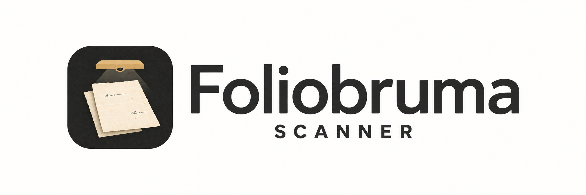

# Foliobruma Scanner



**Turn books, letters, and paper documents into PDFs on your Mac.**

Foliobruma is a free, open-source document camera app. Place a page under the camera, let it capture, then turn the page after the saved signal. Your scans stay on your Mac. Local scanning needs no account or internet connection. Optional upload connects to your Foliobruma account.

> Early version for Apple Silicon Macs. Tested with the **IRIScan Desk 6 Pro**. Use a release download when available, or build from source below. Releases have no Apple Developer ID signature or notarization. Automatic updates are not available.

## What it does

- **Automatic capture:** waits for a clear, still page and checks for movement, hands, and recent duplicate scans.
- **Automatic crop:** detects paper edges and corrects perspective.
- **Book mode:** splits a spread into two pages, with an adjustable spine position.
- **Capture feedback:** uses sounds and visual signals for saved pages, duplicates, obstructions, and rejected scans.
- **Page review:** browse a page sidebar, zoom, rotate, reorder, merge two pages, crop from the original, replace a page, or undo the last removal.
- **Saved sessions:** browse documents by name, page count, and edit date. Original images stay on your Mac.
- **PDF export:** save the pages in the current document to a local PDF.
- **Sheet batches:** scan one or two sides per sheet, finish with a USB button, and group related sheets later in Review.
- **Metadata records and letter batches:** save details without a scan. Use automatic references and shared batch details.
- **QR labels:** preview, export, and print a compact label with an existing HTTPS link. QR codes are generated on your Mac.

There is no OCR or telemetry in this version. Cloud upload is optional and off by default. Exported PDFs contain page images, without a searchable text layer.

## Download and install

Open [Releases](https://github.com/AEnguerrand/foliobruma-scanner/releases/latest)
and download the **macOS-arm64.dmg** file for the required version. Open it,
then drag **Foliobruma Scanner** to **Applications**. Eject the disk image and
open the app from Applications. You need an Apple Silicon Mac with macOS 14
or later. Xcode and Command Line Tools are not required for release downloads.
A ZIP download is also available.

The app has an ad-hoc signature, but no Apple Developer ID signature or
notarization. If macOS blocks it and you trust the download, try to open it,
then use **System Settings → Privacy & Security → Open Anyway**. Follow the
[Apple instructions](https://support.apple.com/en-us/102445). A managed Mac can
prevent this exception. Allow camera access when asked.

To update, quit the app and replace it in Applications. Saved sessions remain
in their current folder. See [release install instructions](RELEASE-INSTALL.txt)
for checksums and backup steps. If no release exists yet, build from source.

## Build and open

You need an Apple Silicon Mac, macOS 14 or later, and Apple Command Line Tools with a macOS 14 or newer SDK. Intel builds are not supported by the current scripts.

Install the tools if needed, then wait for the installation to finish:

```sh
xcode-select --install
```

Clone the repository and build the app:

```sh
git clone https://github.com/AEnguerrand/foliobruma-scanner.git
cd foliobruma-scanner
./build.sh
open "build/Foliobruma Scanner.app"
```

Allow camera access when macOS asks. The build uses Apple frameworks and needs no third-party packages or Xcode project. To use a full Xcode installation, set `DEVELOPER_DIR` to its `Contents/Developer` directory when you run the scripts.

The app is signed locally for development. It is not notarized. A rebuild can cause macOS to ask for camera access again.

## Interface

The app uses the Mac’s appearance and accent colour. The camera and page image
views use a dark background. Gold marks the detected page edges and book spine.
Open **Scanning tips**, **Supported buttons**, or **Print setup** for extra help.
The footer shows rejected scans when photos need review. The Review view has an
**Add scans** button when no page is selected. In Documents, an empty search
result gives a prompt to try another title, reference, or batch name.

Page-number input follows the selected page. An invalid number shows the valid
range. Removing the selected page selects the next page, or the preceding page
when the last page is removed. **Undo removal** restores and selects that page
in Review. Original image files stay on disk.

Document and export panels open the next dialog after the current panel closes.
Document search ignores spaces at the start and end; use **Clear search** to
show all results. Label fields keep their names visible after editing. An invalid
link shows the problem beside the fields. Image and label previews show a loading
state before they show an image or an error.

## Language

The interface supports English and French. On first use, the app follows the
macOS language preference. It uses English when the preferred languages are not
supported.

Open **Foliobruma Scanner → Settings…** (⌘,) or click the gear button in the
toolbar. Select **System language**, **English**, or **Français**. Quit and reopen
the app to apply the change. The selection applies only to this app. Document
names and session files do not change. This setting does not translate scanned
text or add OCR.

The top row contains Documents, the document title menu, Settings, and the
Foliobruma account control. The second row contains Details, Scan, Review, and
completion actions. In Details, use Add scans to start adding pages. Rejected
scans and Undo removal appear in the footer only when available.

## Scan your first document

1. Connect the scanner by USB. In **Scan setup**, select a **Camera** and click **Connect camera**. Use the refresh button if you connected the camera after opening the app.
2. Use the document menu to name your document. In Scan setup, choose **Book** or **Single page**.
3. Put the paper on a contrasting surface with even light. Check that all page edges are visible.
4. Check the gold crop outline. For a book, enable **Split into two pages** and adjust **Spine position** to the centre of the spread. You can also drag the gold handle or click **Centre spine**. Use **Preview crop and split** to inspect a camera frame without saving pages.
5. Click **Start auto capture**, then move your hands away. For manual capture, click **Capture page** or press **Space** in Scan mode.
6. Wait for the green **Saved — turn the page** signal and chime before turning the page. Repeat for each page or spread.
7. Choose **Review**. Capture pauses. Select a page in the sidebar, or enter a page number and click **Go**. Zoom and scroll to inspect the text. Use **Rotate**, **Move earlier**, **Move later**, **Remove**, or **Undo removal** as needed.
8. Click **Export PDF**, check the page count and rejected-photo notice, then choose where to save the file. Progress appears at the bottom of the window. Open the result from **Files → Open PDF** or **Show PDF in Finder**.

Use **Documents → New item…** for another book or group of pages. Select **Scan pages** to use the camera. The document title menu also contains **New item…** and **Rename document…**. Use **Documents** to search saved documents and open one by name. **Open session folder…** remains available for sessions stored elsewhere. Closing the app keeps the session. Returning to Scan does not restart automatic capture.

### Metadata records and letter batches

Open the document title menu and select **New item…** (⌘N). Select **Details
only** to record a physical item without a camera, or **Scan pages** to start
with scanning. The title is optional. An empty title uses the automatic
reference. Type, author or sender, date or period, physical location, tags, and
notes are optional details. Use **Details → Edit details** to change them later.
Use **Add scans** to add pages to the same record.

For a batch of letters, enable **Start a letter batch**. Enter the batch name,
location, and tags once. Each letter gets a reference such as `LET-0001`.
**Next letter** saves a new, empty record and copies those three batch fields.
It clears the title, author, date, notes, and web link. It pauses automatic
capture and selects single-page scanning. Start capture again when ready.
All pages of a letter stay in the same record until you select **Next letter**.
A page turn does not create another letter. Editing batch fields affects the
current letter and later letters created from it, not earlier records.

References are unique within this Mac's library, not across devices. Other
items use `DOC-` references and share the same counter. Gaps are possible after
a failed write. References do not change when you rename an item. Documents
can be searched by title, reference, or batch name.

### Mixed papers: one label per physical sheet

For an unsorted box of letters and papers, open **New item…** and enable
**Start a sheet batch**. Enter a batch name and physical location, such as a
folio number. Each physical sheet gets its own reference, session, PDF upload,
and label. The first capture is the front; the second capture is the back.
Related sheets do not need to be together during scanning.

1. In **Foliobruma**, select an archive and enable **Upload automatically** and
   **Print a label when finished**. With upload off, sheets are saved locally and
   no label prints automatically.
2. In **Settings → USB button**, select **Finish sheet** and enable the learned
   button. The existing **Next document** and **Next letter** button actions also
   finish the sheet when a sheet batch is open.
3. Connect the camera and start automatic capture. Place the front under the
   camera. Wait for **Front saved**. Turn the sheet over if it has a back to scan.
4. After the last saved side, press the USB button or click **Finish sheet**.
   A single-sided sheet needs only one capture. After two sides, capture pauses
   until you finish. A third side cannot be added to the same sheet. Replacement
   remains available in Review. Resolve rejected photos before finishing.
5. The app saves the sheet, uploads its PDF when enabled, and submits its label
   when enabled. In the Foliobruma menu, select **Brother QL-600 · USB** as the
   label printer. No driver, print queue, or print dialog is needed. The printer
   must have a 62 mm continuous DK-22205 roll.
6. Attach the correct label to the sheet sleeve and put it in the folio. The app
   prepares the next sheet and resumes automatic capture when you finish from
   Scan with a connected camera. Recent duplicate checks stay active across the
   sheet boundary. They remain approximate; check the saved reference and image.

An upload error or a cancelled or failed print keeps the current sheet open
and pauses capture. Check the problem and press **Finish sheet** again. A
completed upload is reused. A submitted label does not print again on retry.
Direct USB printing waits for the QL-600 to report completion and return to its
ready state. For a macOS queue, success means that macOS accepted the job.
Check the physical label before filing.
If the app stops with an unknown print result, check the printer and use
**Create label…** if a label is missing. Then use **Confirm label handled** in
the document menu and finish the sheet. This confirmation sends no print job.
Session options are saved and copied to the next sheet or letter in the batch.
A new, unrelated session starts with automatic upload and printing off.

In **Review → Group sheets…**, select sheets from any batch and give the group
a letter or document name. Select a sheet to inspect its front and back. Use
**Reading order** to move or unlink sheets, then select **Save group**. A sheet
can belong to one group. To move it to another group, unlink it and save first.
An empty group is removed on save. Sheet references, individual PDF links,
images, and session folders do not change. To swap front and back, use the
normal page order controls in Review. Image merging is disabled for sheet
batches so the two sides remain separate.

Groups are saved only on this Mac in `sheet-groups.json`, beside the `Sessions`
folder. Include this file in backups. Group changes do not create a combined
PDF or sync to the website. Website grouping needs a separate API and interface
change; this scanner version uploads each sheet as an independent PDF.
Automated tests cover 2,000 ordered sheet links, save conflicts, capture state,
and print retry records. They do not verify a 2,000-sheet camera run or physical
printer output.

### Sign in, upload, and print

The **Foliobruma** button at the top right shows whether you are signed in.
Click it to connect, select an archive, or change upload and label options.
The same controls are in **Settings → Foliobruma account**. Camera controls
remain in **Scan setup**.

Select **Connect on website**. Your normal browser opens Foliobruma. Sign in on
the website, compare its code with the code in the Mac app, then select
**Connect this scanner**. Return to the app and select the destination archive.
The app checks for approval every three seconds. Requests expire after ten
minutes; **Cancel sign-in** stops waiting. Use **Open sign-in page** to reopen
the request while it is pending.

The app stores a separate, limited scanner credential in Keychain. It does not
read browser cookies or ask for your password. Access expires after seven days.
Use **Connected scanners → Disconnect** on the website to revoke it. Sign out
in the app removes the local credential, revokes scanner access when reachable,
and stops uploads until you reconnect. Session options stay saved. Website logout
does not disconnect the scanner.
Older password-based scanner sessions require a new website sign-in.

This flow requires the matching SaaS pairing endpoints and database migration
to be deployed. Until then, connection attempts fail without changing local scans.

Enable **Upload automatically** to send scans to the selected archive.
In the Foliobruma menu, enable **Upload automatically** and **Print a label
when finished** for the current session. Select **Brother QL-600 · USB**.
A finished sheet or book uploads one PDF and prints one label automatically.
The options are saved with this session, not as account-wide settings. They
are off for new sessions. A manual upload has a separate print choice.

1. Scan and review all pages of the letter or book. Rejected photos stay excluded
   unless you choose to keep them.
2. Click **Finish item**. The app saves the session, creates one PDF with the saved
   page order and rotations, and uploads it. A page turn does not finish an item.
3. In a letter batch, **Next letter** finishes and uploads the current letter before
   it starts the next one. The USB **Next document** action also finishes first.
   An upload failure keeps the current document open. **New item…** is a local
   creation action; use **Finish item** before it when you want to upload.
4. The label uses its permanent SaaS URL and full 16-character ID. Sign in on the device that reads the QR
   first. A label does not make the document public. Use **Create label…** to
   print again after checking the result of a failed print.

Upload progress appears in the footer. Uploads accept PDFs up to 500 MiB and use
8 MiB parts. Server storage and membership limits still apply. Metadata stays in
the local session; this API stores the PDF and its filename. No originals or
rejected photos are uploaded. The app must remain open to finish an upload.

After a connection failure, click **Finish item** again. The app reuses the saved
PDF and upload ID. It checks for a completed upload before sending parts again.
A completed, unchanged item does not upload or prompt for printing twice. Editing
an uploaded item and finishing it creates a new PDF version in the archive;
it does not replace or delete the earlier version.

The retry record is `cloud-upload.json` in the session folder. Upload PDFs use
`upload-<id>.pdf` and are retained locally. If an upload start was not confirmed,
or the pages changed during a pending upload, the app stops. Check the archive
on the website and remove any incomplete entry before using the document menu's
**Clear upload record…** action. Clearing the record can cause another copy on
retry. It does not delete local scans or remote files.

Without automatic upload, **Finish item** saves locally and needs no connection.
PDF export remains available without signing in. Account and upload tests use a
mock server, with separate local SaaS integration tests. Production browser sign-in,
Keychain access, network uploads, and physical
label printing require an end-to-end check on the target Mac.

### Compact QR labels

Open **Create label…** from the document title menu or the Details view.

- **Item link:** paste an existing permanent HTTPS link from `foliobruma.com`.
  **Save item link** stores it in the current record. After upload, the app uses
  the permanent SaaS URL returned by the label API. Manually entered links
  are not checked for access or availability.
- **Custom link:** enter any HTTPS destination independently of the current
  record. Custom label text and links are not saved with the record.

Edit the label title and optional second line. The default uses the item title
(or batch name) and its reference. These edits change only the label. Custom links
are limited to 100 UTF-8 bytes to keep the QR compact; long printed text is
shortened, while the QR contains the full link. A short permanent link is best.

The label is **62 × 25 mm** for the **DK-22205** continuous roll, in black on
white. Select **Print with QL-600** for direct USB printing. It needs no Brother
driver or macOS print queue. Connect one QL-600, turn it on, and close its cover.
The app checks the roll before sending data and waits for completion. If the
result is unknown, check the physical label before printing again. It does not
automatically retry a job that might have printed.

The QR is the main element. Its white border includes the physical paper margins,
so the code can fill the printable height without changing the label size. The full SaaS label ID
is beside it, with the title below. The preview and PDF use the same layout.
**Print…** requires a working system queue.
The printed QR must be tested with a phone before a large batch.
Label generation works offline. Opening the SaaS link requires a connection.
Legacy PDF links can use up to 180 bytes; new uploads use short permanent links.
Sign in to Foliobruma on the reading device before opening a private PDF link.

### Review and correct pages

- **Merge with next page…** joins the selected page (left) and the next page (right) into one page. Use **Move earlier** or **Move later** to put the two pages in order first. The merge uses their current crops and rotations, matches their heights without changing their proportions, and replaces them with one page at the same position. Export again to include the merged page in the PDF. Source images and source page records are kept. **Crop from original…** on a merged page uses the full merged image. The merge does not align overlapping map details or remove a seam. **Undo removal** does not undo a merge.

- **Replace…** returns to Scan to capture one replacement page. A successful save keeps the page position and page identity. The old image and original remain on disk. Split capture is disabled for a replacement. A rejected or failed replacement leaves the existing page in the document.
- **Crop from original…** shows the full original image. Adjust the four edge sliders and save the selected rectangle. For a book spread, select only the required side. This manual crop does not apply perspective correction; the existing page rotation is kept. The original and earlier processed image are retained.
- **Rejected** opens photos that are excluded from the PDF. Inspect the image with zoom before using **Keep this scan anyway**. **Rescan** returns to the camera, but keeps the rejected photo in the review list until you keep or dismiss it. **Dismiss from review** keeps its image file and removes the review entry.
- The footer distinguishes the saved session from the exported PDF. After an edit, **PDF needs export** means that the earlier PDF has not changed. Export again to include the edit. PDF export status applies to the current app session.

Keyboard controls: **⌘O** opens Documents, **⌘N** opens New item, **⌘E** opens the export summary, **← / →** changes the selected review page, **⌘⇧← / ⌘⇧→** moves that page earlier or later, **⌘R** rotates it, and **⌘Z** undoes the last removal. **Space** captures a page in Scan mode. Use Tab to move between controls.

### Review shortcuts

| Shortcut | Action |
| --- | --- |
| **← / →** | Select the previous or next page. |
| **⌘⇧← / ⌘⇧→** | Move the selected page earlier or later. |
| **⌘R** | Rotate the selected page. |
| **⌘⌫** | Remove the selected page, or dismiss the current rejected photo. Image files are kept. |
| **⌘Z** | Undo the last page removal. This does not undo dismissal of a rejected photo. |
| **⌘⇧C** | Open Crop from original. |
| **⌘⇧R** | Replace the selected page, or rescan the current rejected photo. |
| **⌘0** | Fit the review image to the window. |
| **⌘Return** | Keep the current rejected scan, or save the crop in the crop editor. |
| **Escape** | Close rejected-photo review, or cancel the crop editor. |

Saved pages are already included in PDF export. They do not need approval.
Use **Keep this scan anyway** only after you check a rejected photo. Shortcuts
for page changes are disabled while a save or other operation is in progress.

### Physical USB button

Open **Settings → USB button**. Select the device, select an action, then click
**Learn button** and press the physical button once. Learning stays active until
you press or click **Cancel**. **Signals received** shows input from the selected
device, even before learning. Press it again to check the
**Test presses** counter. Enable **Enable button action**, close Settings, and
select the document window. The setting is saved on this Mac.

| Action | Suggested use |
| --- | --- |
| **Capture page** | Recommended for a scanner button or foot control. Uses manual capture with the normal quality checks. |
| **Start or pause auto capture** | Start or stop a scanning run without the keyboard. |
| **Next document** | Save the current document and start an empty document. Requires at least one saved page. |
| **New item…** | Open the form for a new document or metadata record. |
| **Next letter** | Start the next letter in the current batch, with shared batch details. |
| **Finish sheet** | Save the front and optional back, upload and print when enabled, then prepare the next sheet in a sheet batch. |
| **Review pages** | Pause capture and inspect saved pages. |
| **Export PDF** | Open the export summary. You still choose the file location. |

One device and one learned signal can be assigned at a time. Actions run only
in the active document window. They are blocked in Settings, dialogs, and while
the app is busy. Reports less than 0.6 seconds apart are treated as one press;
wait at least 0.6 seconds between presses. Device removal stops input. Reconnect
to the same USB port if the device has no serial number, or select and learn it
again. A disconnected saved device remains in the selector.

The IRIScan button with USB ID `2e5a:2015` sent a repeatable signal during a local
test. Other USB HID button or vendor controls can be learned if they send the
same report for each press. Keyboards, mice, and devices with changing report
counters are not supported by this setting. Test the counter before enabling
an action: a release or an idle report must not count as another press. This
feature does not change camera detection, capture quality checks, or saved files.

### Capture signals

| Signal | Meaning | What to do |
| --- | --- | --- |
| Green border and saved chime | Page files and the session are saved. | Turn the page. |
| Amber **Already scanned** message and short tone | A recent duplicate was detected. No extra copy was saved. | Turn the page, or use manual capture for an intentional repeat. |
| Small amber warning and soft tone | A hand or missing page edges are blocking automatic capture. | Clear the page and check its position. |
| Red **Rescan needed** message and low tone | The captured photo failed a quality check. It is not in the PDF. | Correct the issue and capture again. |

The speaker switch controls capture sounds. Visual signals remain active when sound is off. A quality rejection pauses automatic capture and opens the rejected-photo review. If a quality check is wrong, inspect the photo before using **Keep this scan anyway**.

Duplicate checks compare image detail with the last four saved captures. Different text pages can pass even when their layout is similar. The check runs again while the page is still; a duplicate warning does not require a page turn to clear. Small shifts or lighting changes can still let a repeat pass. Use manual capture if a different page is blocked.

Automatic capture requires at least 0.55 seconds of a clear, still page. Camera capture, checks, and saving add time. A sustained obstruction produces a warning after 1.5 seconds; brief page-turn movements should not produce a warning tone.

## Your files

Click **Files → Originals and session** to open the current session folder. Sessions are stored at:

```text
~/Library/Application Support/Sovenelia Scanner/Sessions/
```

The old `Sovenelia Scanner` folder name and app identifier are retained to keep existing scans and preferences available.

```text
<session-id>/
├── Originals/    Original captures
├── Pages/        Processed page images
├── Rejected/     Photos rejected by quality checks, when present
└── session.json  Document name, optional metadata, page order, rotations, and rejected-photo review records
```

Metadata is stored in `session.json`; older sessions remain readable. The local
reference counter and lock file are in `~/Library/Application Support/Sovenelia Scanner/`.
Back up this folder with Sessions to retain the counter. If the counter is
missing, the app checks saved records before assigning another reference.

Removing a page removes it from the document, but keeps its image files. Replacement and crop operations also keep previous image files. Older sessions remain readable. Rejected photos with no saved review record are recovered for inspection; their earlier crop settings may be unavailable. Rejected photos are excluded from PDF export unless you keep them. Exported PDFs are separate files. Back up the whole session folder if you want to retain the originals and continue editing later.

## Current limits

- **Check the crop outline.** Detection works best with clear edges and bright paper against a darker surface. Turn **Auto crop** off if the outline is wrong.
- **Curved pages stay curved.** Perspective correction is supported; curved-book dewarping is not. The spine split is a straight line.
- **Detection can miss problems.** Hand and duplicate checks are approximate. Similar pages can be mistaken for duplicates, and lighting changes can cause duplicates to pass.
- **Review image quality.** Checks cover hands, very dark images, heavy blur, and detected page edges at the camera boundary. They do not reliably detect glare, shadows, missing text, or fine-detail blur.
- **Hardware support is limited.** Other cameras may work, but only the IRIScan Desk 6 Pro has been tested. Live warning timing and sound playback need more hardware testing.

## Troubleshooting

| Problem | Try this |
| --- | --- |
| No camera preview | Check the USB connection and selected camera. Allow the app under **System Settings → Privacy & Security → Camera**, then reopen it. |
| Automatic capture does not start | Check the page edges, remove your hands, and hold the paper still. Review any warning. Use manual capture if needed. |
| An intentional repeat is blocked | Use **Capture page** or **Space** in Scan mode. Manual capture bypasses duplicate detection; quality checks still apply. |
| A good scan is rejected | Review it, then use **Keep this scan anyway** if it is complete and readable. |
| A scan repeats after a lighting change | Pause automatic capture, remove the extra page, and keep the lighting steady. |

## Development

Run the regression tests without connecting a scanner:

```sh
./test.sh
```

Tests use temporary sessions and do not request camera access. They cover session persistence, failed-write recovery, page operations, crop coordinates, capture gates, warning gates, quality rejection with manual override, review capture exclusion, page replacement, original-image preservation, old session decoding, saved-document discovery, and PDF export failure recovery.

Source files are grouped by purpose under `Sources/FoliobrumaScanner/`: app setup,
models, scanner operations, capture gates, image checks, and views. The build and
test scripts include all Swift files in these folders.

GitHub Actions uses separate workflows. **Build** tests and builds branch
pushes, pull requests, and manual runs. **Release** tests, packages, and
publishes only when a version tag (`vX.Y.Z`) is pushed.

See [CONTRIBUTING.md](CONTRIBUTING.md) for the source layout, checks, release steps, and bug report guidance.

## License

[MIT](LICENSE). You can use, modify, and distribute the app, including for commercial use, under the license terms.

The Foliobruma account panel groups sign-in and **After scanning** settings.
Enable **Upload automatically** to make **Print a label when finished** available.
The label option runs only after a successful upload and uses this session’s
selected printer. The QL-600 USB option does not open a print dialog.

To upload an item manually, select **Upload to Foliobruma** beside **Export PDF**.
Sign in if needed, select the destination archive, and select **Upload now**.
All saved pages are sent as one PDF. This does not enable automatic upload or
start another item. The sheet also lets you choose whether to print a label.

### QL-600 integration checks

Direct USB printing was checked on macOS 26 with a connected QL-600 and a 62 mm
continuous roll. The printer produced and cut a test label without a driver;
the completion and ready responses were received. Physical QR readability still
needs a check with the reading device. Automated tests decode the packed printer
raster, including the physical paper margins, and cover uncertain print results.

The scanner saves the SaaS reservation request ID before the request. It reuses
that ID on retry, attaches the completed PDF with a revision check, and prints
the permanent `/d/` URL with the full SaaS label code. A lost response is checked
before retrying. A conflicting website edit stops the operation. If an already
labelled item's content changes, replace the PDF on the website to keep its ID;
the scanner does not silently create a second permanent identity.

### Developer server

Production is the default server. To test another server, open **Settings** and
click the version text five times. Enable **Developer mode**, enter an HTTPS
origin such as `https://staging.foliobruma.com`, then click **Save server settings**.
Quit and reopen the scanner. A DEV indicator shows the active server.

Sign in again for that server and start a new test document. Each server has a
separate Keychain credential and selected archive. Saved upload records stay
bound to their original server; legacy records belong to production. Label URLs
come from the selected server. Local scanning works without a connection.

The server must permit native scanner API requests. A browser-only Cloudflare
Access login is not sufficient; the scanner does not copy browser cookies or
follow API redirects. To return to production, disable developer mode, save,
and restart the app.

For a developer server protected by Cloudflare Access, restart on that server,
then enter its service token in the developer settings. **Save Access token**
stores both fields in macOS Keychain for the current origin. The secret is not
stored in preferences or sessions. The scanner sends the Access headers only
to that developer server; redirects are still blocked. The Access policy must
use **Service Auth** and select this token. SaaS sign-in is still required.
Use **Remove Access token** to remove the local copy. Revoke the token in
Cloudflare to remove server access.

### Automatic capture and crop limits

Automatic duplicate checks compare the paper content as well as the full frame.
A hand, label, or lighting change outside the paper should not count as a page
turn. Paper comparison reduces camera noise and aligns small position changes.
Similar pages, or a page with only a small new note, can need manual capture;
detection is approximate.
The crop outline follows the dimensions of the delivered camera frames.
The scanner uses the full-resolution camera frame when the still-photo output
has less detail or a different aspect ratio, so it does not cut off the preview.
Auto crop finds edges again on the captured photo because the photo and preview
can have different framing. It keeps a small outer margin and uses the paper
mask when a rectangle would cut into it. Original photos stay in the session;
use **Crop from original** to adjust a saved page.
